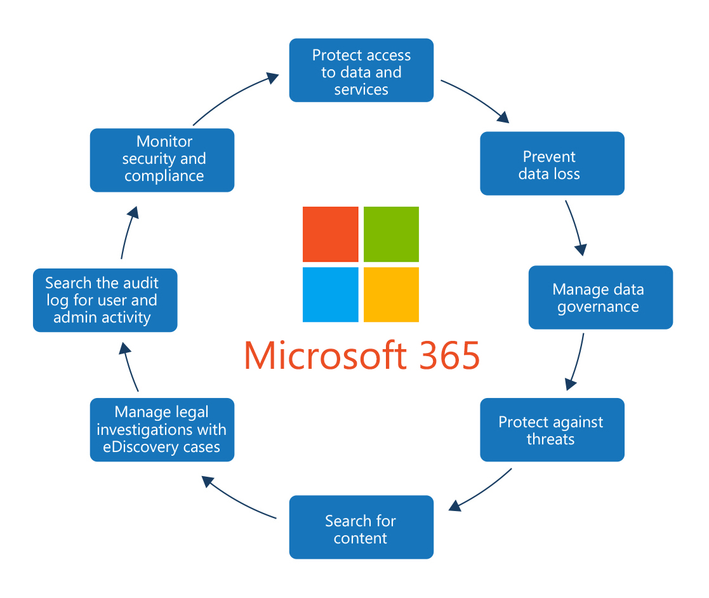
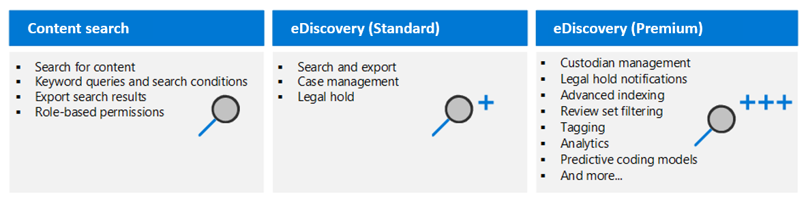
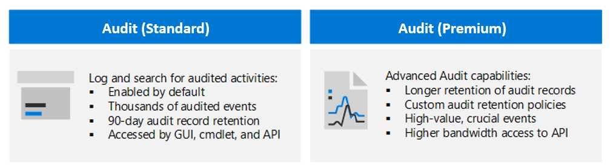

# Monitor and investigate data and activities by using Microsoft Purview
## Compliance in Microsoft 365

Step 1: Review capabilities.
Step 2: Check your Secure Score.
Step 3: Plan access protection for identity and devices.
Step 4: Plan data protection based on data sensitivity.
Step 5: Use the Microsoft Purview compliance portal.
Step 6: Use beginning-to-end security scenarios as starting points.
### Compliance in Purview
### Compliance Manager
Compliance score
- Improvement action score
- Control score
- Assessment score
## Search for content in the Microsoft Purview compliance portal
### eDiscovery

### create a content search
### View the search results and statistics
### search permissions filtering
### Search for and delete email messages
## Microsoft Purview eDiscovery (Standard)
### eDiscovery holds
Holds preserve content that may be relevant to a case. 24 hours to take effect, 30-day grace period
### Search for content in a case
### Export
### Close, reopen, and delete a case
## Manage Microsoft Purview eDiscovery (Premium)
### custodians and non-custodial data sources
Custodians in eDiscovery are persons who own or control data that could be relevant to a case.
## Audit (Standard)

