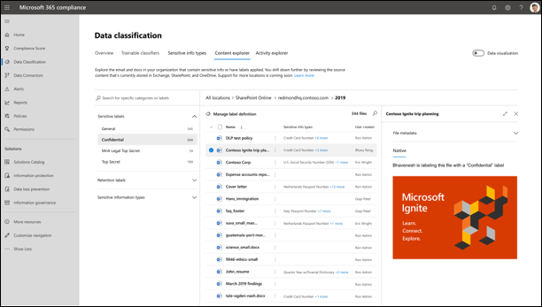

# Introduction to information protection and data lifecycle management in Microsoft Purview
## Know your data
Data classification
- Sensitive information types
  -  a pattern that can be identified by a *regular expression* or *function*
- Trainable classifiers
  -  trainable classifiers, use artificial intelligence and machine learning, training a classifier to identify an item based on what the item is, not by elements that are in the item
- Labels
  - Manual labeling on all platforms
  - Automated labeling in Office for the web and Windows
  - Automated labeling on content stored in OneDrive, SharePoint, and Exchange
- Policies
   - Sensitivity label policies
   - Data loss prevention (DLP) policies
   - Retention policies and retention label policies
## Protect your data
### data loss prevention (DLP) solution
- Data source `which user can share what`
- Data destination `who to share with`
- Amount shared `single credit card number vs 1000`
- Exposure impact `prompt the user with a tool tip to educate them about the consequences`
## Govern your data
Data Lifecycle Management
Records management
- Streamlined administration `one policy across multiple services`
- Automation at scale `policy work automatically and applied organization-wide`
- Tailored workflows `custom events: eg departure of an employee`
# Classify data for protection and governance
## Sensitive information types (SIT)
- Built-in SITs `such as social security numbers, credit card numbers, and email addresses, can't be edited, can serve as templates for creating custom sensitive information types`
- Named entity SITs `such as person names, physical addresses, or medical terms and conditions, predefined and can't be edited or copied`
- Custom SITs
- Exact data match (EDM)-based SITs `built from scratch`
### SIT consists
- Name
- Description
- Pattern
  - Primary element
  - Supporting element
  - Confidence Level
  - Proximity
### Creation
`By UI, EDM, Powershell`
## Classify data using trainable classifiers
- Pre-Trained Classifiers
- Custom Trainable Classifiers `A one-time scan must be completed before creating any custom trainable classifiers. This process takes 7 to 14 days.`
  - Seed
  - Test
  - Publish
## The Overview page

- Top sensitive info types
- Top sensitivity labels applied to content
- Top retention labels applied to content
- Top activities detected
- Locations where sensitivity labels are applied
- Locations where retention labels are applied
- Azure Information Protection labels summary
## Content explorer

- amount of sensitive data in a document
- filter by label or sensitive information type
- Integrated viewer to display detected documents
## Activity explorer
### activities
- File created
- File modified
- File renamed
- File copied to cloud
- File accessed by unallowed app
- File printed
- File copied to removable media
- File copied to network share
- File read
- File copied to clipboard
- Label applied
- Label changed
### filters
- date range
- activity type
- location
- user
- sensitivity label
- retention label
## Compare built-in versus custom sensitive information types
### SIT PARTS
- Primary pattern
- Additional evidence
- Character proximity
- Confidence level
### special features of custom SITs
- Exact Data Match (EDM)-based classification `exact values`
- Document Fingerprinting `standard -> sensitive`
- Keyword dictionaries `less accurate than EDM-based`
# Create and manage sensitive information types
## Compare built-in versus custom sensitive information types
### Sensitive information type parts
- Primary pattern `Employee ID numbers, project numbers, etc. usually regex`
- Additional evidence `ep: . Not all nine-digit numbers are employee ID numbers, so you can look for more text with keywords like "employee", "badge", "ID"`
- Character proximity `proximity window: the character distance between the primary pattern and the supporting evidence`
- Confidence level `Higher confidence means more evidence and fewer false positives, while lower confidence means less evidence and more false negatives.`
### Custom sensitive information type features
- Exact Data Match (EDM)-based classification `when large quantities of sensitive information need to be matched daily`
- Document Fingerprinting `Converts a standard form into a sensitive information type`
- Keyword dictionaries `manage reused keyword lists for matching company information on a large scale`
## EDM-based classification
- exact data match
- `Set up EDM-based classification -> Hash and upload the sensitive data -> Use EDM-based classification with your Microsoft cloud services`
## document fingerprinting
won't detect sensitive information in the following cases:
- Password protected files.
- Documents that only contain images.
- Documents that don't contain all the text from the original form used to create the document fingerprint.
## keyword dictionary
# Apply and manage sensitivity labels
## 
Only a label with encryption can have access rules to prevent other user to edit or open the file.
apply a label to a Group and SharePoint site.
- Creation wizard of a Group or SharePoint Site
- SharePoint Admin Center for existing ones
- Microsoft Teams Admin Center for existing ones
- Azure portal
- PowerShell
## on-premises labeling
- unified labeling scanner
## email and files
- manual
- auto-apply functionality `Default label for new, by sensitive information types / with or without a hint, by trainable classifiers`
## label analytics
## Microsoft Sentinel
