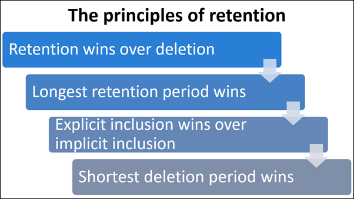

# Implement Data Lifecycle and Records Management
## Data Lifecycle Management overview
Retention policy precedence

### Configure retention labels
- Name your label
- Label settings
- Review your settings
### Configure manual retention label policies
- Choose labels to publish
- Publish to users and groups
- Name your policy
- Review your settings
### Configure auto-apply retention label policies
- Choose label to auto-apply
- Choose conditions
- Settings (only valid for sensitive info condition)
- Name your policy
- Locations
- Review your settings
### Import data for Data Lifecycle Management
## Manage data retention in Microsoft 365 workloads 
### in Exchange Online

### in SharePoint Online and OneDrive
Preservation Hold Libraries
### in Teams
When user leave
- Documents and Files `same as SharePoint and OneDrive`
- Chat messages `inactive mailbox, remain subject to any retention policy`
- Channel messages `in Azure database and the mailbox, unaffected`
### in Yammer
- Documents and Files ``
### Recover content
deletion
versioning
### Microsoft Exchange
## Manage records in Microsoft Purview