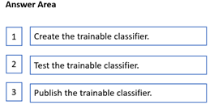
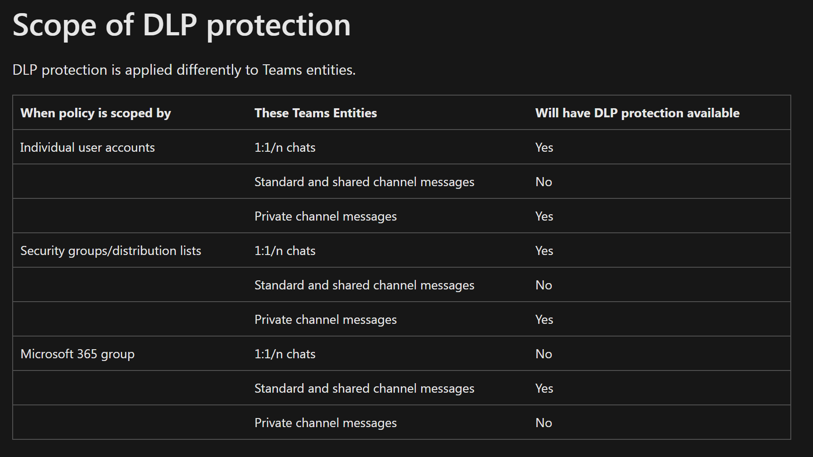

1. no auto, no empty policies for  
2. Cloud App Security currently supports applying Azure Information Protection classification labels for the following file types: Word, Excel, PowerPoint, PDF, The policy will classify only 100 files daily.
3. The max size for the OME encryption functionality is 25 mb and all file extension are not covered by the OME encryption. You can only encrypt docx files, powerpoint files and excel files. The following are the one supported,
Old file extension such as xls, doc and ppt are not supported.
5. You cannot apply watermarks to email, so the header will only get applied.
But you can for sure add both watermarks and headers to documents located at Sharepoint.
6. You can create a sensitivity label named Passport Number and configure it to apply encryption and a watermark to the content. You can also choose to restrict access to specific users or groups, or block external sharing.
You can create an auto-labeling policy named Passport Number Policy and select the Passport Number label to apply automatically. You can also choose the locations where you want to apply the policy, such as Exchange Online, SharePoint Online, and OneDrive for Business. You can then define a condition to match the content that contains passport numbers from the United States, Germany, Australia, and Japan.
7. Sublabels don't inherit settings from their parent label
, when you remove a label that applied encryption to a document you don't necessarily remove the encryption.
8. Resumes, Source code, Harassment, Profanity, Threat are pre-trained classifiers that exist already in Microsoft 365 -> Source code is correct
9. NEW tenant - Global admin is required to opt in
    While Compliance Administrator role is required to train a classifier
11. Create a trainable classifier: 
    - Collect between 50-500 seed content items.
    - Place the seed content in a SharePoint Online folder that is dedicated to holding the seed content only.
    - Sign in to the Microsoft Purview compliance portal with either Compliance admin or Security admin role access and navigate to Data classification > Classifiers.
    - Within 24 hours the trainable classifier will process the seed data and build a prediction model. 
    - Collect at least 200 test content items (10,000 max) for best results.
12. You should run the New-OMEConfiguration cmdlet to create a new OME configuration. Then, modify the branding template using Set-OMEConfiguration cmdlet. OME(Office Message Encryption), Information Rights Management (IRM)
13. You can upload data with the EDMUploadAgent to any given data store only twice per day. EDM(Exact Data Match)
14. you should create a mail flow rule that applies the Encrypt action to all email messages sent to fabrikam.com. You can use the Apply this rule if… condition to specify the recipient domain. (needs recheck)
15. you cannot modify a policy template in MCAS. You can create policies from policies templates. (nice question)
16. Unlike manual labeling or auto-labeling with Office apps, PDF attachments as well as Office attachments are also scanned for the conditions you specify in your auto-labeling policy. When there is a match, *the email is labeled but not the attachment*.
17. The keywords for your dictionary could come from various sources, most commonly from a file (such as a `.csv` or `.txt` list) imported in the service or by PowerShell cmdlet.
18. You can revoke a mail that you sent to a single recipient that uses a social account such as gmail.com or yahoo.com. In other words, you can revoke an email sent to a single recipient that received the link-based experience.
You cannot revoke a mail that you sent to a recipient that uses a work or school account from Office 365 or Microsoft 365 or a user that uses a Microsoft account, for example, an outlook.com account.
19. (outdated)
20. (outdated)
21. Mail Flow rule will fit the bill.
22. requires revisit
23. https://www.examtopics.com/discussions/microsoft/view/64731-exam-sc-400-topic-1-question-23-discussion/
24. The Schema of EDM SITs is in XML, but only data hashes are uploaded via EDM upload agent. 
25. 
```powershell
$Employee_Template = [System.IO.File]::ReadAllBytes('C:\My Documents\Contoso Employee Template.docx')
$Employee_Fingerprint = New-DlpFingerprint -FileData $Employee_Template -Description "Contoso Employee Template"
$Customer_Template = [System.IO.File]::ReadAllBytes('D:\Data\Contoso Customer Template.docx')
$Customer_Fingerprint = New-DlpFingerprint -FileData $Customer_Template -Description "Contoso Customer Template"
New-DlpSensitiveInformationType -Name "Contoso Employee-Customer Confidential" -Fingerprints $Employee_Fingerprint[0],$Customer_Fingerprint[0] -Description "Message contains Contoso employee or customer information.
```
26. Run the `Set-OMEMessageRevocation` cmdlet.
27. The only prerequisite for using the new OME capabilities is that **Azure Rights Management** must be activated in your organization's tenant. If it is, Microsoft 365 activates the new OME capabilities automatically and you don't need to do anything.
28. You want to seed with **only good** documents **to train** your trainable classifier correctly so that it knows what to look for.
When you **test** it you want **both good and bad** examples to know if it can detect both false and true positives.
29. the Global admin needs to opt in for the tenant to create custom classifiers.
Compliance Administrator role is required to train a classifier.
Retention label policy scenario: Record Management and Retention Management roles
Sensitivity label policy scenario: Security Administrator, Compliance Administrator, Compliance Data Administrator
Communication compliance policy scenario: Insider Risk Management Admin, Supervisory Review Administrator
30. You can't automatically label documents and emails until your policy has run at least one simulation.
31. fiscal year
32. To **retrain** a trainable classifier you can easily do this through **Content Explorer** found under the same tab as you can find Trainable Classifier, under Data Classification.
33. Keyword dictionaries can be created either from a text file or from csv file.
Note:
There are several versions of this question in the exam. The question has two possible correct answers:
a **CSV file** that contains words separated by **commas**
a **text file** that has **one word on each line**
34. Don't choose a parent label as the default label, or configure a parent label to be automatically applied (or recommended). If you do, the parent label can't be applied.
35. Co-authoring and AutoSave aren't supported and don't work for labeled and encrypted Office documents that use any of the following configurations for encryption:
✑ Let users assign permissions when they apply the label and the checkbox In Word, PowerPoint, and Excel, prompt users to specify permissions is selected.
This configuration is sometimes referred to as "user-defined permissions".
✑ User access to content expires is set to a value other than Never.(should not be never)
Double Key Encryption is selected. (should be unselected)
36. (revisit)
37. Web apps `Microsoft SharePoint Online and OneDrive` need to be enabled separately for sensitivity labels.
38. 
39. Keyword dictionaries = Sensitive info type
40. If there's a conflict in settings from multiple policies, the settings from the policy with the highest priority (highest order number) is applied.
41. Always custom branding templates for this, you can use the following cmdlet
```powershell
New-OMEConfiguration -Identity "Expire in 7 days" -ExternalMailExpiryInDays 7
```
42. 
43. Content Explorer, Compliance Data Administrator
44. File Policies allow you to enforce a wide range of automated processes using the cloud provider's APIs. Policies can be set to provide continuous compliance scans, legal eDiscovery tasks, DLP for sensitive content shared publicly, and many more use cases.
Note:
There are several versions of "**share sensitive documents** from Microsoft OneDrive to any users **outside** your company" in the exam. The question has two possible correct answers:
**From the Microsoft 365 compliance center, create a data loss prevention (DLP) policy.**
**From the Cloud App Security portal, create a file policy.**
Other incorrect answer options you may see on the exam include the following:
✑ From the Microsoft 365 compliance center, start a data investigation.
✑ From the Azure portal, create an Azure Information Protection policy.
45. (requires recheck)
## Topic 2
1. SQ
2. 
- **Third-party DLP policy matches**: These are matches that occur when a third-party DLP solution is integrated with Microsoft 365.
- **DLP policy matches**: These are matches that occur when a DLP policy is triggered.
- **DLP incidents**: These are events that occur when a DLP policy is triggered and an action is taken.
- **False positives**: These are events that occur when a DLP policy is triggered but the content does not actually contain sensitive information.
- **Overrides**: These are events that occur when a user overrides a DLP policy.
3. SQ
4. SQ
5. add Firefox and Google Chrome to the unallowed browsers list.
   Create a DLP policy that applies to the Devices location. create a dlp policy which applies to location "Devices" and create a rule which applies to the label "Confidential" with the action "Upload to cloud service domains or access by unalloed browsers" -> "Block"
6. Teams use `SharePoint` and `OneDrive` to store files, channels and chat also needs policy applied
7. Rule2 will take place since it has the higher restrictions out of all of them - User Overrides ON is less restrictive than having it OFF.
Rule2, both Rule2 and Rule4 have the same restrictivness so we have to look at the priority level here which means Rule2 gets applied.
8. SQ
9. review the potential impact of enabling the policy without applying the actions. -> *Edit the policy, and then select I'd like to test it out first.*
10. SQ
11. SQ
12. SQ
13. You have to try this out to remember this better imo, when you create a DLP policy **with all the location choosed** you can only choose the following conditions
- **Content contains**
- Content is **shared from M365**
14. If you want to view the DLP alert management dashboard or to edit the alert configuration options in a DLP policy, you must be a member of one of these role groups:
```
Compliance Administrator
Compliance Data Administrator
Security Administrator
Security Operator
Security Reader
```
To access the DLP alert management dashboard, you need the Manage alerts role and either of the following roles:
```
DLP Compliance Management
View-Only DLP Compliance Management
```
15. You need to be **alerted** when users **share sensitive** documents from Microsoft **OneDrive** to any users outside your company.
What should you do?
From the Microsoft 365 compliance center, create a data loss prevention (DLP) policy.
From the Cloud App Security portal, create a file policy.
16. when outside your organization or with unauthorized users are mentioned -> DLP
17. *Default notifications settings* are: The person who sent, shared, or modified the content / Owner of the SharePoint site or OneDrive account/ Owner of the SharePoint or OneDrive content.
18. given sites -> service domains
19. Outdated question, windows 10,11 and MacOS are supported for Endpoint DLP
20. dupe Q
21. regex, recheck
22. sq
23. sq
24. sq
25. sq
26. sq
27. sq
28. CE, bit confusing
29. With 1 policy you cannot choose both Audit and Block. policies are the top-level containers that define the scope, mode, and notifications of DLP enforcement. 
30. dup
31. Create a fingerprint of AssessmentTemplate.docx.
32. disputes, go with **alert filter**
33. DLP policy that will protect *documents shared in Teams chat* = Onedrive
*Teams channels* = Sharepoint
34. different elements in a policy rule, such as:
```
The name and description of the rule
The source and destination of the traffic or data
The service or protocol of the traffic or data
The action to take when the rule matches (such as allow, deny, block, audit, encrypt, etc.)
The priority or order of the rule
The schedule or duration of the rule
The notification or alert of the rule
```
35.  retrieve a summary of the DLP rule matches from the last seven days:
    Exchange Online and Get-DlpDetectionsReport.
36. the ONLY actions the Endpoint DLP *can't* restrict is
- **Create** an item
- **Rename** an item
37. Device onboarding is shared across Microsoft 365 and Microsoft Defender for Endpoint (MDE). If you've already onboarded devices to MDE, they will appear in the managed devices list and no further steps are necessary to onboard those specific devices. Onboarding devices in Compliance center also onboards them into MDE. *If you want to use endpoint DLP you have to onboard the devices* (recheck)
38. instinctive
39. sq
40. sq
41. sq
42. sq
43. outdated?
44. Despite status showing resolved it still can be changed. Select alert > Under Alert status > Actions > select "Edit comments" > choose new status: *Active, Investigating, Dismissed or Resolved*.
45. With all locations selected the sensitive info type is the only option left for DLP policy.
46. source code -> trainable classifier
47. maintain the sensitivity of DLP1 -> configure an alert threshold
48. instinctive
49. documents in Teams -> OneDrive
50. Auto-labeling policies for retention labels can only apply to files that are supported by the trainable classifiers, which are:
Word documents (.docx)
PowerPoint presentations (.pptx)
PDF documents (.pdf)
Text files (.txt)
Email messages (.eml)1
Excel workbooks (.xlsx) are not supported by the trainable classifiers, so they will not be labeled by the auto-labeling policy.
51. Moderate -> Forward the message for approval
    Policy mode: Enable -> Enforce DLP rules
52. disputes, go with suggested
53. a **file policy** is a type of Microsoft Defender for Cloud Apps policy that allows you to monitor and control file sharing activities in your cloud apps, and detect DLP violations based on the content, context, and sensitivity labels of the files
- A **Cloud Discovery anomaly detection policy** is a type of policy that allows you to detect anomalous activities and risky behaviors in your cloud environment, such as unusual locations, devices, or app usage patterns¹.
- An **activity policy** is a type of policy that allows you to monitor and control user activities in your cloud apps, such as login, upload, download, or share¹².
- A **session policy** is a type of policy that allows you to apply real-time controls and actions on user sessions in your cloud apps, such as block download, watermark, or redirect¹².
54. 
55. The DLP policy blocks everyone from accessing shared content that matches the rules, except for the content owner, the last modifier, and the site admin. The first uploader is not neccessarily the owner.
56. sq
## Topic 3
1. In case of multi match, Microsoft keep the minimum of risk so it will not be deleted and keep the longest time of the policy.
2. policy for scope, label for specifications
3. If you REMOVE the tag only, everything (retention) stays the same in Exchange Mailbox, but the used won't be able to apply the tag to other mails of folders.
If you DELETE the tag, then that also removes the retention policies from the emails of folders where it was originally applied.
4. `Get-Mailbox cmdlet` provides all mailboxes that meet certain parameters.
5. `Restore-RecoverableItems` and `Get-RecoverableItems`
6. When a retention policy is locked:
✑ No one, including the global admin, can disable the policy or delete it
✑ Locations can be added but not removed
You can extend the retention period but not decrease it
7. hmm
8.  retention policy -> container (site, mailbox) level
    retention label policy -> item level
9. To be able to treat the contracts as records with need retention labels.
To mark automatically mark the contracts with can place the retention label as default label in the a document library
10. Although a retention policy can support multiple services that are identified as "locations" in the retention policy, you can't create a single retention policy that includes all the supported locations. If you select the **Teams or Viva Engage** locations when you create a retention policy, the other locations are automatically **excluded**.
11. For SharePoint and OneDrive sites: The copy is retained in the Preservation Hold library. On (Pending) -> recycle bin
For Exchange mailboxes: The copy is retained in the Recoverable Items folder.
For Teams and Viva Engage messages: The copy is retained in a hidden folder named SubstrateHolds as a subfolder in the Exchange Recoverable Items folder.
12. Regulatory records are the most restrictive type which means that you cannot do much to the files, they are well protected. In this case you will only be able to move the file WIHTHIN the container.
13. The Disposition Management role is included in the Records Management default role group, which is assigned to Compliance Administrators by default. Global Administrators, Security Administrators, and Search Administrators do not have the Disposition Management role by default. (check above for roles)
14. Where the Prerequisites for the Exchange Online PowerShell module hyperlink mentions the ExchangeOnlineManagement module being needed for the Connect-IPPSSession command.
Use the Set-RegulatoryComplianceUI cmdlet to display the UI option in retention label settings to mark content as a regulatory record.
IPPSSession is a **PowerShell session** that connects to the **Security & Compliance Center** in Microsoft 365.
15. A retention policy is used to apply the same retention settings to entire locations or workloads, not specific files
16. A new **event type** will make sure that the retention period will use **fiscal year** instead of when items were created
17. The email will be moved to the archive mailbox after two years.
To change the retention period for archiving, you should modify the Default MRM Policy. (Go with Bing)
18. label -> label policy -> preservation lock
19. You cannot use the OneDrive website, the OneDrive Recycle Bin, or the Restore your OneDrive feature to recover a file from a deleted OneDrive account, use **the Restore-SPODeletedSite PowerShell cmdlet**.
    The Restore-SPODeletedSite PowerShell and the Restore-ADObject PowerShell are two different cmdlets that are used to restore different types of objects.
The Restore-SPODeletedSite PowerShell is used to restore a **deleted SharePoint Online site collection** from the Recycle Bin.
The Restore-ADObject PowerShell is used to restore a **deleted Active Directory object**
20. (pay more attention on the year, not only the date)
21. Sensitivity info type makes more sense to me, as it's focused on just the project documents in a site with "many files". If you do a trainable classifier you'd need a large set of "good" examples and this could take a while. But if you were to create a custom sensitive info type and use regex expressions then it should be simpler to implement.
22. Teams channel conversations: documents shared -> Sharepoint
Teams private chat: documents shared -> OneDrive for Bussiness
23. same as mentioned, regulatory records are strict.
24. Set -RetentionCompliancePolicy and -RetryDistribution are correct.
25. `New-Mailbox -InactiveMailbox`
26. an auto-labeling policy, a sensitive info type, a retention label
27. importing a records management file plan -> retention labels
28. `New-MailboxRestoreRequest -SourceMailbox`
29. retention label policy of type **publish**: available for users to manually apply to their content
**auto-apply**: applied automatically to content based on the conditions defined in the rule
30. instinctive
31. Disposition review can only performed members of Disposition Management Role, by default both Compliance Administrator och Compliance Data
Administrator have access to this but NOT GA.
32. DUPE
33. dupe
34. instinctive
35. `ExchangeOnlineManagement Connect-IPPSSession Set-RegulatoryComplianceUI`
36. **file plan** helps you create and manage retention labels.
37. declare a collection of files that are stored in Library1 as regulatory records -> a retention label policy
38. Create and publish a new retention label is a solution to this since we want to create a new rule for one file named FIle1 in Site1, this file will then get retained for 7 years instead of 5 years (what a strange question)
39. Records Management role group
40. Classifiers are available to use as a condition for:
Office auto-labeling with sensitivity labels
Auto-apply retention label policy based on a condition
Communication compliance
Sensitivity labels can use classifiers as conditions, see Apply a sensitivity label to content automatically.
Data loss prevention
41. If adaptiv scope is type "group" you have only following options:
Teams channel Message,
Yammer community messages,
M365 group mailboxses & sites

If adaptive scope type is "User":
Exchange mailboxes
OneDrive accounts
OR (cann't be together)
Teams chats
Teams private channel messages
Yammer user messages

If adaptive scope type is "Site":
SharePoint sites

## 


## Scenario questions

1. You implement Microsoft 365 Endpoint data loss prevention (Endpoint DLP).
You have computers that run Windows 10 and have Microsoft 365 Apps installed. The computers are joined to Azure Active Directory (Azure AD).
You need to ensure that Endpoint DLP policies can protect content on the computers.
Correct solutions:
**onboard the computers to Microsoft Defender for Endpoint**
**deploy the Endpoint DLP configuration package**
Incorrect:
Microsoft Intune, unified labeling client
1. You are configuring a file policy in Microsoft Cloud App Security.
You need to configure the policy to apply to all files. Alerts must be sent to every file owner who is affected by the policy. The policy must scan for credit card numbers, and **alerts** must be sent to the **Microsoft Teams site** of the affected department.
Correct solutions:
use the Build-in DLP inspection method and send alerts to **Microsoft Power Automate**.
Incorrect:
Can't send email to the affected channel
1. You recently discovered that the developers at your company emailed Azure Storage keys in plain text to third parties.
You need to ensure that when Azure Storage keys are emailed, the emails are encrypted.
Correct:
configure a **mail flow rule** that matches a **sensitive info type**
Incorrect:
 A DLP policy can only detect, audit, and block sensitive information from being shared, but it cannot encrypt the emails by itself, but works if **only exchange location is selected**
 a mail flow rule that matches the text patterns
1. You have a Microsoft 365 tenant and 500 computers that run Windows 10. The computers are onboarded to the Microsoft 365 compliance center.
You discover that a third-party application named Tailspin_scanner.exe accessed protected sensitive information on multiple computers.
Tailspin_scanner.exe is installed locally on the computers.
You need to block Tailspin_scanner.exe from accessing sensitive documents without preventing the application from accessing other documents.
Correct:
**unallowed apps list** from m the Microsoft 365 Endpoint data loss prevention (Endpoint DLP) settings
Incorrect:
*app discovery policies* to alert you when new apps are detected within your organization
Folder path to the *file path exclusions* excludes certain paths and files from DLP monitoring.
Make **unsanctioned** only prevents the application from accessing cloud resources that are protected by Microsoft Defender for Cloud Apps
1. 